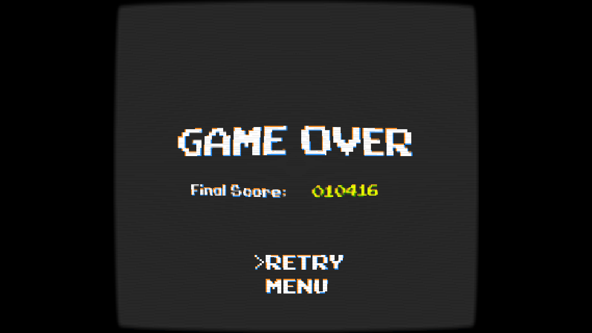

# GodotSTM
A Simple customizable Text Menu plugin for Godot.

It adds a "SimpleTextMenu" node to Godot, in which you can easily create a retro-like text menu with as many options you want.

Its main features:
* Can add as much options you need.
* Editor-friendly, you can check the menu changes in real-time.
* Signal-friendly, it's easy to check which option is being selected.
* Options to change the cursor side and menu orientation.

*Menu example, used with [SimpleGodotCRTShader](https://github.com/henriquelalves/SimpleGodotCRTShader)*

## How to use
Simply download this repository, and copy the GodotSTM folder to your Godot project; then enable the plugin on the 'Plugins' tab (on 'Project Settings').

To add options to your menu, edit the "options" variable of the node; each line will be a new option (this is the easiest way I found to add more options).

This repository has a demo Scene you can check to see how the plugin works.

## License
The "Cave-Story" font used in the demo was created by enigmansmp1824; it's CC-BY-SA licensed, and can be found in https://fontlibrary.org/pt/font/cave-story.

The plugin uses the MIT License.
